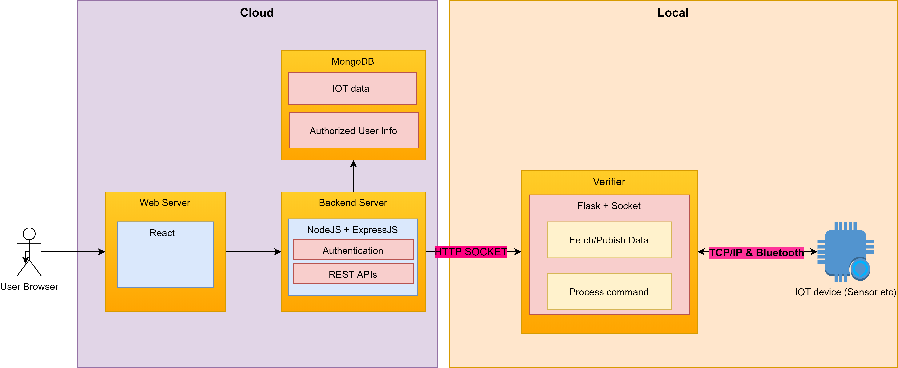

# Architecture Overview

The whole system is separated into two parts, the web-cloud and local.  The cloud consists of modules serving a web application. The local, consists of python scripts running on lab machine and respberry-pi.

### Web Cloud 

The web cloud  system is implemented with the modern full-stack web solution MERN (MongoDB, ExpressJS, React, NodeJS)

- **React**: Provided UI for data-visualization and IoT device manipulation
- **NodeJS & ExpressJS**:  Backend server with data controller.
- **MongoDB**: Hosting data for IoT and Authentication 

### Local

The local section mainly consists of

- **Verifier**:
  - A local http server built with **Flask** 
  - Handles requests from the cloud and execute instructions such as fetching and publish data
- **IoT Server**: 
  - Runs on IoT devices such as sensors etc
  - Connected to verifier via Bluetooth/socket

### Web App Deployment:

- Frontend: Firebase
- Backend: Heroku
- Database: MongoDB Cloud

