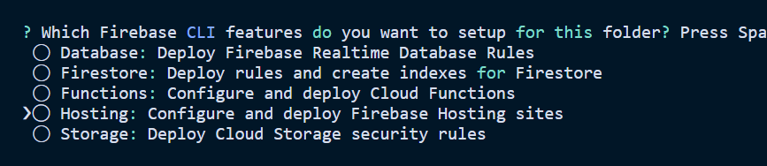

# Deployment

### Install Firebase CLI using npm

First, install the firebase CLI

```text
npm install -g firebase-tools
```

### Login to Firebase

Next associate the Firebase CLI with a Firebase account \(Google account\):

```text
firebase login
```

### Deploy 

Next, move to the project's folder and execute the following command, which initializes a Firebase project for the Firebase hosting features:

```text
firebase init
```

Then, choose the Hosting option. If you are interested in using another tool to host your Firebase application, choose another option:



Select your Firebase project from a list of projects from the Firebase platform


 Use the _build/_ folder


Deploy

```text
Firebase deploy
```

