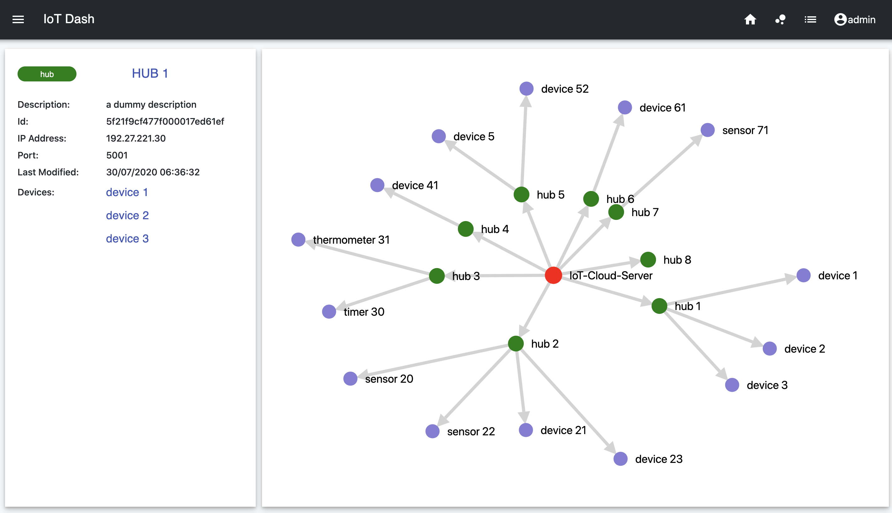
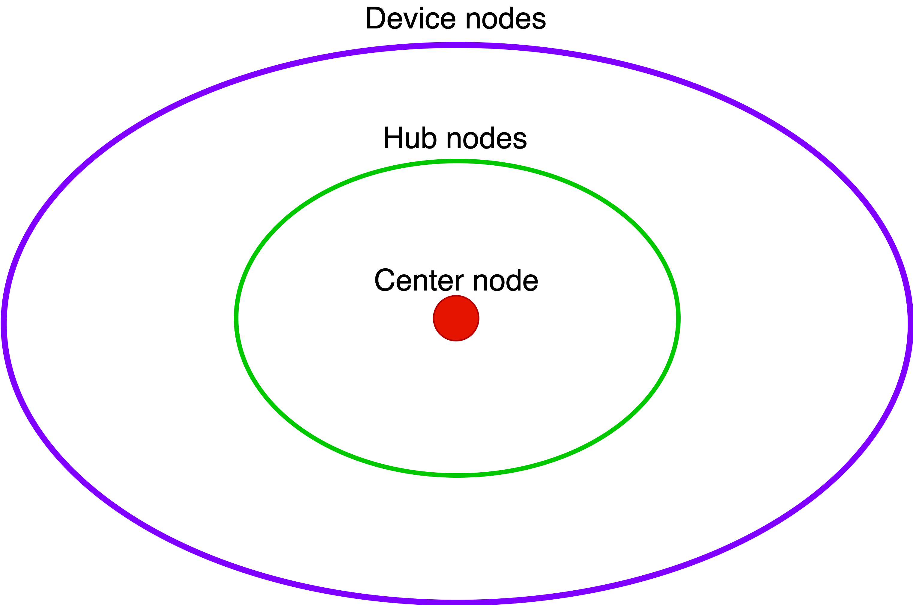

# Network diagram

## What tools/libraries are used?

The diagram is implemented using [d3](https://d3js.org/) & [react-d3-graph](https://github.com/danielcaldas/react-d3-graph) libraries.

## How are the nodes being positioned?

In short, there are 3 layers of nodes, 

1. A center node in **red**
2. Hub nodes in **green**
3. Device nodes in **purple**

The algorithm calculates the among of devices a hub owns, and assign a portion of space to that particular hub. The more devices a hub owns, the larger the radian degree will be given to this hub and its devices.

The radius of the ellipses are defined by the current windows size. 

A random index\(0.2\) is assigned to the position of a node.

