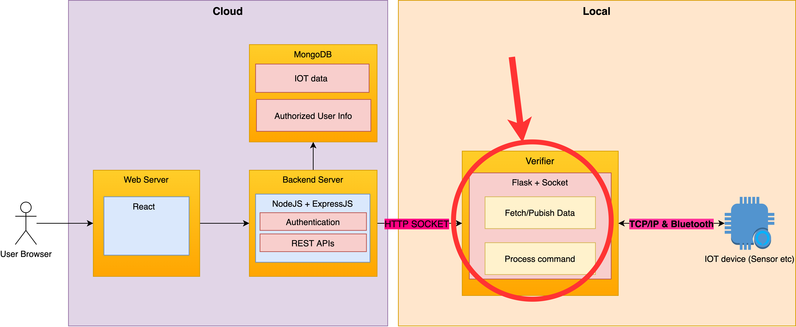

# Integration of python server



The integration of legacy & other python scripts is pretty straightforward. 

Here is the example of code being executed when a hub command is received \(when [http://localhost:5001/command/hub](http://localhost:5001/command/hub) is being called\)

Just replace the commented lines with code to be executed, such as calling a function & running a python script.

```python
class HubCommand(Resource):
    def get(self):
        print("received hub command")
        query = request.args.get("query")
        print(f"executing command: {query}")
        # Add code to execute command
        # example pseudo code:
        #
        # switch (query):
        #   restart: restart()
        #   power-on: powerOn()
        #   ...
        
api.add_resource(HubCommand, '/command/hub')
if __name__ == '__main__':
    app.run(host='0.0.0.0', port=5001)
```

