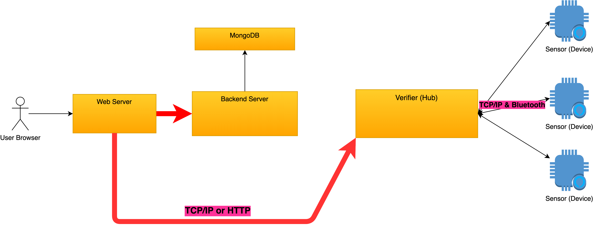

# Possible Add-ons

## Security

The current implementation has no concerns on the security. Though login is required to view the page, but actually there is no protection on the requests to both the backend and the local verifier.

Possible security add-ons:

* HTTP requests with JTW token verifications.
* Limited token life-cycle \(token only valid for 3 hours\)
* Separate user-information database from the IoT database.

### Publish/subscribe to all

The current implementation used only supports one-to-one communication, for both web-to-verifier and verifier-to-device.

Neither the network socket or http socket are good in one-to-more communication, might consider other network protocols such as MQTT.

